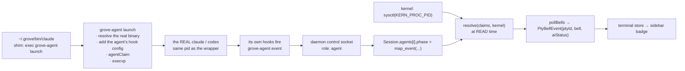

# Agent Status: Hooks, the Kernel, and Nothing Else

**Status**: implemented. Supersedes the 2026-03-28 "Grove Hooks Runtime for Claude/Codex Parity" proposal — the `CODEX_HOME` overlay, the manifest/merge runtime, the `@grove_ai_status` tmux options and the PTY hookless fallback are all gone (see [What was deleted](#what-was-deleted)).

## The thesis

The sidebar badge answers one question: **is my agent working, done, or waiting for me?** Grove derives it from exactly two inputs, and refuses to guess from anything else.

| Input | Source | Answers |
|---|---|---|
| **What the agent is doing** | the agent's **own hook events** — Claude Code and Codex both ship hooks, including `PermissionRequest`, which fires at the exact instant the agent blocks on a human | `running` / `attention` / `idle` |
| **Whether the agent still exists** | the **kernel**, queried at READ time (`pid` + `p_starttime` fence + `p_stat`) | alive / dead / suspended |

Everything else is deleted. Status is **never persisted** — it is derived on every poll — so there is nothing to garbage-collect, nothing that can wedge across a reboot, and nothing a file can lie about.

**Below a hooked agent there is no inference rung.** An agent grove cannot hook gets **no badge**, deliberately. One wrong badge poisons trust in every correct one.

## The pipeline

## The launcher (`grove-agent`)

One binary, installed at the byte-stable path `~/.grove/bin/grove-agent`, with two subcommands. It sits on the agent's critical path (both agents run hooks **synchronously** and await each one), so **every path is wall-clock capped and every path exits 0**.

### `grove-agent launch <tool> -- <args…>`

1. **Resolve the real binary** — PATH minus grove's own shim dir. Layered exclusions (`GROVE_BIN_DIR`, `dirname(current_exe)`, self-exe, a `GROVE_AGENT_WRAPPER` content sniff, and `GROVE_AGENT_SKIP` for version-manager shims that re-exec by name), plus a depth cap that strips `~/.grove/bin` from the child's PATH as an absolute backstop. Without these the wrapper re-finds *itself*: a dead pane at 100% CPU.
2. **Add the agent's hook config** (below).
3. **Claim the pane** over the daemon socket (200 ms cap), and export the daemon-minted `GROVE_CLAIM_ID`.
4. **`execvp` the real agent.**

**It execs. It never becomes a parent, never `waitpid`s, never proxies signals.** This is not style: a fork-and-wait wrapper **wedges the pane on Ctrl-Z**. A TUI that self-suspends the textbook way (restore the tty, `raise(SIGTSTP)` on itself) stops alone, while the wrapper stays foreground blocked in `waitpid` — the shell never regains the terminal, and only a kill gets the pane back. With `exec` the suspended process *is* the job, so the wedge is structurally impossible. It is also what makes the pid fence meaningful: **the wrapper's pid IS the agent's pid**, so the kernel watches the right process.

### `grove-agent event`

Reads the hook JSON on stdin, extracts **`hook_event_name` + `tool_name` and nothing else** — no cwd, no `tool_input`, no transcript path, so **no PII crosses the socket** — and relays it. Budget: 150 ms, enforced by a watchdog thread (a read timeout cannot save you from a blocked `connect()` on a full listen backlog). A healthy round trip is ~0.3 ms of socket time inside a ~2.5 ms process.

Dropping a status event is harmless by design — liveness comes from the kernel and the next event self-corrects. Stalling the agent is not.

## How each agent's hooks are installed

| Agent | Mechanism | Why not the obvious thing |
|---|---|---|
| **Claude Code** | a **plugin**: `--plugin-dir ~/.grove/plugins/grove-status` | `--settings` is **last-wins on the WHOLE OBJECT** — an earlier `--settings` contributes *nothing*, not even its unrelated keys. Grove's shipping argv put grove's `--settings` first, so **any user who passed their own silently lost every grove hook and every badge**; and the naive fix (grove's last) destroys the *user's* hooks instead. `--plugin-dir` is repeatable and accumulating, so grove's hooks live in a layer the user's `--settings` structurally cannot reach. |
| **Codex** | `-c hooks.<Event>=<inline TOML>`, six flags | `hooks=<path>` is impossible (`hooks` is a struct, not a path). No `CODEX_HOME` overlay, no symlink farm, nothing written into `~/.codex`. `async = true` silently *disables* a hook, and the default hook timeout is 600 s — grove sets `timeout = 5` on every one. |

**Fallback**: `--plugin-dir` on a claude too old to have it is a hard "unknown option" error, which would *break the agent*. So grove probes `claude --help` once, off the critical path; the plugin's existence is the cached answer. Without it, grove **merges** its hook groups into the user's own `--settings` (the user's object is the base; grove's groups are appended per event — multiple groups under one event all fire, so nobody's hooks are lost). An unreadable user settings file is passed through untouched, so claude prints its own error rather than grove swallowing it.

**The hook command is byte-stable forever** (`'~/.grove/bin/grove-agent' event`). Codex hashes the hook *command string* for its trust review — a path that gained a version, or an argument that moved, would re-show its "Hooks need review" modal on every grove upgrade.

## The events, and the one mapping table

`grove-daemon/src/agent.rs::map_event` — ~40 lines, pure, no regex, and **no per-tool discriminant**: codex's hook event names are CamelCase and byte-identical to Claude's, both in the config keys and in `hook_event_name` on the wire.

| Event | Phase | Badge |
|---|---|---|
| `SessionStart` | Idle | `<tool>:idle` |
| `UserPromptSubmit` | Working | `<tool>:running` |
| `PreToolUse` | Working | `<tool>:running` |
| `PreToolUse{tool_name: "AskUserQuestion"}` | **Waiting** | `<tool>:attention` |
| `PermissionRequest` | **Waiting** | `<tool>:attention` |
| `PostToolUse` | Working | `<tool>:running` |
| `Stop` | Idle | `<tool>:idle` |
| anything else | **unchanged** | — |

Two rows carry the entire "needs you" feature. `AskUserQuestion` is special-cased because Claude **auto-allows** it, so a question to the user arrives as a `PreToolUse` and never as a `PermissionRequest` — without that row, asking the human a question would badge `running`.

**An unknown event leaves the phase unchanged.** A new agent release that invents an event is a no-op, never a wrong badge. That is the whole forward-compatibility story and it costs zero lines. `Notification` is unmapped *on purpose*: it is redundant with `PermissionRequest`, its type enum is unstable across versions, and mapping it to attention would leave a sticky false attention after `Stop` with nothing left to clear it. (It still rings the bell, exactly as it does today — a notification is a bell, not a state.)

## Liveness: the kernel, at read time

`resolve(claims, kernel)` runs on every `pollBells`. It prunes any claim whose pid is gone, is a **zombie** (SIGKILLed and not yet reaped — `sysctl` still lists it), or whose `p_starttime` no longer matches (PID reuse). A **suspended** agent (`p_stat == SSTOP`, i.e. Ctrl-Z) is `idle`.

| Scenario | Result | Why |
|---|---|---|
| agent exits / SIGTERM / pane closed | badge clears | pid gone at the next read |
| **agent SIGKILLed or OOM-killed** | **badge clears** | pid gone. **No trap, no TTL, no wedge.** The old status file could not survive this: a `trap` cannot catch SIGKILL, so the badge wedged at `claude:running` **forever**, across app restart *and* reboot. |
| agent Ctrl-Z'd | `idle` | a suspended agent is not working, and it is not waiting on you |
| a `Stop` event is dropped on the wire | self-corrects on the next event, and **cannot outlive the process** | liveness is not derived from events |
| app quit for an hour, then reopened | correct | events kept arriving into the live daemon; the first poll after reopening resolves them against the live kernel |
| daemon dies / reboot | badge clears | the PTY died with it, so the agent died with it — and nothing was persisted to resurrect a claim |

## Security: bytes on a terminal cannot make a badge

**No sequence of bytes emitted on a terminal can produce, modify, or clear an agent badge.** The PTY stream is not a status channel at all, so `cat`ing a file, a hostile build log, an alt-screen TUI and a compromised host over `ssh` are all *structurally* incapable of forging status. The property is obtained by subtraction.

To write status you must complete an `agentClaim` RPC, which requires three things — only one of them a secret:

1. **`GROVE_SESSION_KEY`** — a *derived* per-session capability in the pane's env (`SHA-256(daemon_token, session_id)`). It authorizes exactly two methods on exactly one session. **The daemon token itself never enters a pane** — a shell that held it could call `kill` or `shutdown`.
2. **The kernel peer pid** — read from `getsockopt(LOCAL_PEERPID)` at `accept()`. A claimant cannot lie about who it is.
3. **The controlling terminal** — the claimant's `e_tdev` must equal the pane shell's. This closes the **nested-tmux hole**: a tmux server started in pane A hands pane A's session key to every shell it later spawns, so under any env-carried design (the old status file included) an agent opened from pane B would badge **pane A**, with a *valid* key. It cannot here — a process inside nested tmux has tmux's pty as its ctty. Consequence, stated plainly: **an agent inside nested tmux gets no badge.** We cannot know which pane it is in, so we say nothing.

`agentEvent` is authorized differently — by **capability**, not ctty: every hook subprocess calls `setsid()` (`e_tdev == NODEV`, `open("/dev/tty")` → `ENXIO`), so a ctty check there would reject *100 % of events*. A hook presents the session key plus the daemon-minted `claimId`, which exists only in the agent's env. The nested-tmux hole stays closed: tmux inherits the key but never a `claimId`, because its agent's *claim* is ctty-rejected.

**Residual, and accepted**: a script running *inside the pane, as the user* can read its own env and claim a fake agent. It already has the user's shell, tty and filesystem. What matters is that **passive content cannot**.

## The degradation ladder

Every rung below the first yields **nothing** rather than something wrong.

| Rung | Who lands here | Status |
|---|---|---|
| **A. Hooked agent** (`claude` / `codex` launched through grove's PATH shim) | almost everyone | **Full fidelity.** `running` / `idle` / `attention` **at the instant the agent blocks**. Correct while the app is closed. Survives SIGKILL. |
| **B. Codex before its one-time hook-trust review** | every user, exactly once | Codex shows **its own** "Hooks need review → Trust all and continue" modal the first time it starts under grove. Until it is answered its hooks do not run, so the badge sits at `codex:idle` for that one session. After the user answers once it never appears again — not on new worktrees, not on new repos, not on grove upgrades (the hook command is byte-stable). |
| **C. `grove-agent` not installed, or an agent launched outside the shim** (`npx claude`, an absolute path, a shell alias or function, a third-party agent, an agent over `ssh`) | some | **No badge.** The agent runs normally. There is no honest phase signal and grove will not invent one. |
| **D. An old daemon the supervisor adopted** | during an app update, until that daemon restarts | **No badge.** `role:"agent"` is additive at protocol **v1** — the version is deliberately *not* bumped, because the socket and the on-disk history root are version-namespaced, so a bump would orphan every shell the user has running and lose their scrollback. An older daemon cannot decode the role and refuses the hello; the claim fails silently and the agent execs anyway. |
| **E. A plain shell, `vim`, a build, nested tmux** | everyone, constantly | **No badge, ever.** Structurally guaranteed: a badge requires a claim, and a claim requires an RPC that bytes cannot send. |

## Why not the terminal title (and the other tempting signals)

| Signal | Verdict |
|---|---|
| **OSC 0/2 title** | **Dead as a status source.** Claude's BLOCKED title and its IDLE title carry the **same leading glyph** (U+2733) — an information-theoretic gap no parser can close. `codex doctor` exposes the title format as a **user preference**. And oh-my-zsh sets OSC 2 to the command line, so typing `claude --version` in a **plain shell** would badge as an idle agent. The daemon still parses the title — for the tab title. It is a display string, used for display. |
| **OSC 9 notifications** | A generic notification bus (it also fires *while working*) whose discriminating field is not on the wire. Consuming it would reduce to string-matching English prose. It stays a **bell**. A notification is not a state. |
| **The process table** (`ps` tree walk) | Basename matching phantom-badged on `vim /tmp/codex`, and `exec -a claude /bin/sleep 30` forges it in one line. Identity is **declared** by grove's launcher and **verified** by the kernel — never guessed. |
| **Output-silence timers** | A *blocked* codex repaints its spinner continuously, so an output timer reports `working` **precisely when the human is being waited on**. The old 30 s timer manufactured `attention` out of silence — a lie by construction. |
| **Enter-key detection** | "The user pressed Enter, therefore an agent is working" fires for `ls`. |

## What was deleted

| Deleted | Why it had to go |
|---|---|
| `GROVE_AI_STATUS_FILE`, the `ai-status/` dir, `grove_ai_write`, `grove_ai_cleanup`, the `trap … EXIT INT TERM HUP` | The file *was* the "script that cats a file" spoofing surface. Last-writer-wins with no fence. And the trap cannot survive SIGKILL — the badge wedged at `claude:running` forever, across app restart and reboot. |
| `~/.grove/bin/grove-hook` | The status file's dispatcher. Nothing reads that channel now. |
| `HOOKLESS_TOOLS = ["codex"]`, `is_hookless_tool`, `needs_idle_detection` | **Factually wrong.** Codex ships hooks, `PermissionRequest` included. Codex now gets a **real** attention badge the instant it blocks, instead of one invented from 30 seconds of silence. |
| The `ps -Ao` probe: `HooklessProbe`, `process_line_mentions_tool`, `reconcile_hookless_ai_status` | Phantom-badged on `vim /tmp/codex`. Forgeable. |
| `CODEX_OUTPUT_IDLE_TIMEOUT` (3 s), `HOOKLESS_ATTENTION_TIMEOUT` (30 s), `idle_since`, `last_output_at` | Proxies for facts grove now reads directly. See "output-silence timers" above. |
| `Session::detect_enter` | Guessed. Fired for `ls`. |
| The `setAiStatus` RPC and the client-side status state machine | The app is no longer a writer. **One writer, one owner.** `poll_bell_events` is now a pure delta emitter (~170 lines → ~30). |
| The `CODEX_HOME` overlay and the hook manifest/merge runtime (the 2026-03-28 proposal) | Never built, and no longer needed: `-c hooks.<Event>=` carries codex's hooks with no overlay and no git trace. |

Agent-specific knowledge dropped from **five** places to **one**: a 40-line pure function.

## Invariants for anyone touching this

- **The renderer contract is frozen**: `PtyBellEvent{ptyId, bell, aiStatus}`, the `"<tool>:<status>"` string, and the three values (`running` / `idle` / `attention`).
- **The ZDOTDIR overlay stays.** It re-prepends `~/.grove/bin` to PATH *after* all user config, and it is what delivers the **`open` link-interception wrapper**. A previous rewrite dropped it and broke link interception silently. `daemon_child_env` now *also* prepends `~/.grove/bin` directly — which is what finally gives bash/fish/nu users the shims — but that complements the overlay, it does not replace it. Regression-tested: `daemon_child_env_carries_the_zdotdir_overlay_when_installed`, `daemon_child_env_puts_grove_bin_first_on_path_and_carries_the_agent_channel`, and the `.zshrc` assertions in `tool_hooks`.
- **Keep the `grove_reset_tui_state` precmd hook.** It clears the mouse/focus reporting a dying TUI leaked; without it, clicks at the prompt become escape-sequence garbage.
- **The hook command string must never change.** Codex's trust hash covers it.
- **Nothing in `grove-agent` may hang, error, or block the agent.** Every failure costs the badge, and only the badge.

## Where the code lives

| Concern | File |
|---|---|
| the wire (role, key derivation, claim/event params) | `grove-core/src/daemon/protocol.rs` |
| the shims, the hook definitions, the plugin, the ZDOTDIR overlay | `grove-core/src/tool_hooks.rs` |
| the pane's env (PATH, socket, derived key) + the delta emitter | `grove-core/src/pty.rs` |
| the launcher and the hook relay | `grove-agent/` |
| the mapping table + the resolver | `grove-daemon/src/agent.rs` |
| the kernel oracle (`sysctl`, `LOCAL_PEERPID`) | `grove-daemon/src/kernel.rs` |
| admission checks + `pollBells` | `grove-daemon/src/server.rs` |
